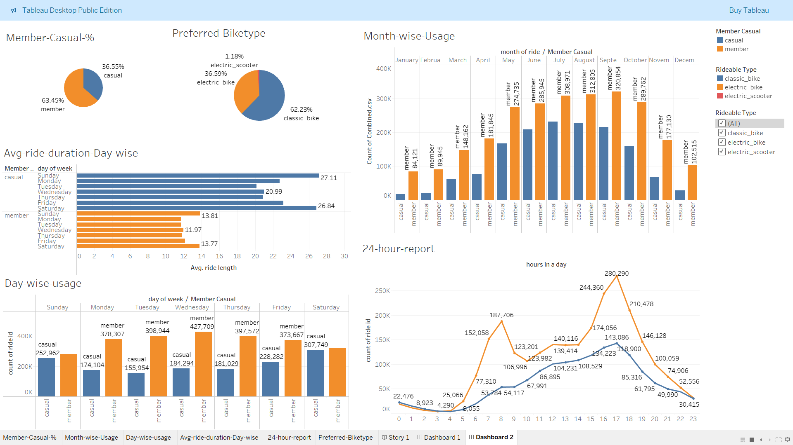

# Cyclistic Bike-Share Data Analysis
_This project is my Capstone Project for the Google Data Analytics Professional Certificate._

The goal of this project is to analyze bike-share usage data and provide actionable recommendations to help Cyclistic design marketing strategies that convert casual riders into annual members.

## Overview

Cyclistic, a fictional bike-share company in Chicago, wants to increase profitability by converting casual riders into annual members. This project aims to ***understand how annual members and casual riders use bikes differently.***

## Key Findings

- Casual riders take longer trips but mostly on weekends & holidays.

- Peak hours for weekaday trips are same for both Annual members and Casual riders.(likely commuting)

- Casual riders are more seasonal, while members ride year-round.

## Dashboard
- Tableau Dashboard shows:
    - Types of Customers
    - Prefered Biketype
    - Day-wise & Month-wise Usage
    - Average Ridetime Day-wise
    - Usage Peak-hour

## Final Recommendations

- **Weekend promotions:** Target casual riders with discounts/membership offers on weekends.

- **Commuter plans:** Highlight convenience and cost-saving benefits for weekday riders.

- **Seasonal campaigns:** Encourage casual riders during high-use summer months.

## Author & Contact
**Shubham Rathore**
📧 Email:shubhamrathore7078@gmail.com
